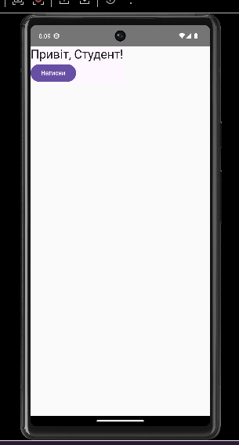
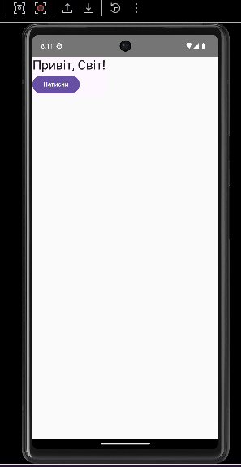

Навчальний Android-проєкт на Kotlin з використанням Jetpack Compose.

## Опис проєкту

Цей проєкт створений у межах лабораторної роботи.
У застосунку реалізовано простий екран на Jetpack Compose з текстом і кнопкою.
Після запуску на екрані відображається текст `Привіт, Студент!` та кнопка `Натисни`.
Після натискання на кнопку текст змінюється на `Привіт, Світ!`.

## Що реалізовано

- створення Android-проєкту в Android Studio
- використання Kotlin
- використання Jetpack Compose
- запуск застосунку на емуляторі або реальному пристрої
- налаштування Git і GitFlow
- створення шаблонів Issue та Pull Request
- підключення CI через GitHub Actions

## Як запустити

1. Встановіть Android Studio та Android SDK.
2. Клонуйте репозиторій:
   ```bash
   git clone https://github.com/OWNER/REPO.git
   cd REPO
   ```
3. Відкрийте проєкт у Android Studio.
4. Дочекайтесь завершення Gradle Sync.
5. Запустіть застосунок на емуляторі або фізичному пристрої.

## Структура гілок

- `main` - стабільна версія
- `develop` - основна гілка розробки
- `feature/*` - окремі функції
- `release/*` - підготовка релізу
- `hotfix/*` - термінові виправлення

## CI

У проєкті налаштовано GitHub Actions workflow `android-ci.yml`, який:
- збирає debug-версію
- запускає unit tests
- виконує lint

## Скріншоти

### Головний екран до натискання


### Головний екран після натискання


## Автор
Данило Смага 

Лабораторна робота №1 з дисципліни Android / Mobile Development.
